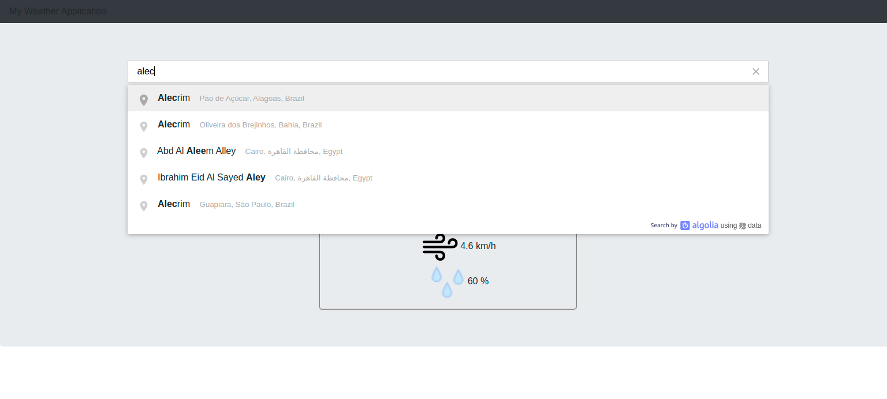
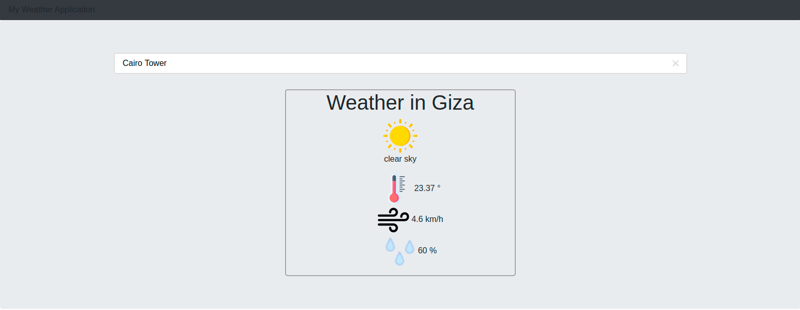

# Weather Application

A Simple Weather Application .

[Click To Check The Project Details](https://www.theodinproject.com/courses/javascript/lessons/weather-app)

## Authors

This project was executed by the duo of :

- [Mohamed Naser](https://www.linkedin.com/in/mohamednaseramein/)

## Used Tools

- HTML
- CSS
- JavaScript
- Axios
- Open Weather APIs
- algolia APIs
- MarkDown Syntax


## Setup

Open your git bash and cd to the location you'd like to put your files the run the command below.

```console
git clone git@github.com:mohamednaser/Weather.git
```

## Live Version

Live version [TBE].

## ScreenShots



